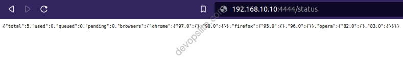
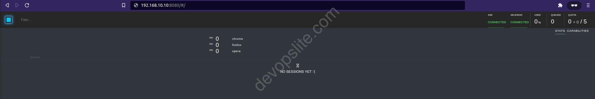

# Install Selenoid with Docker Compose

## 1. Requirement

- **`OS`**: Linux base, prefer Ubuntu server 20.04 LTS
- **`Docker`**: newest version, tested with Docker version 20.10.10, build b485636
- **`Docker Compose`**: newest version, tested with docker-compose version 1.29.2, build 5becea4c

## 2. Use

Remember to use user `sudo` or `root` to run the following commands.

- Clone this repository to your server
- Move to the folder repository

    ```sh
    cd selenoid
    ```

- Run compose

    ```sh
    docker-compose up -d
    ```

- Update compose

    ```sh
    docker-compose pull
    docker-compose up -d
    ```

- Remove compose

    ```sh
    docker-compose down
    ```

## 3. Check the result

- Selenoid status



- Selenoid GUI

